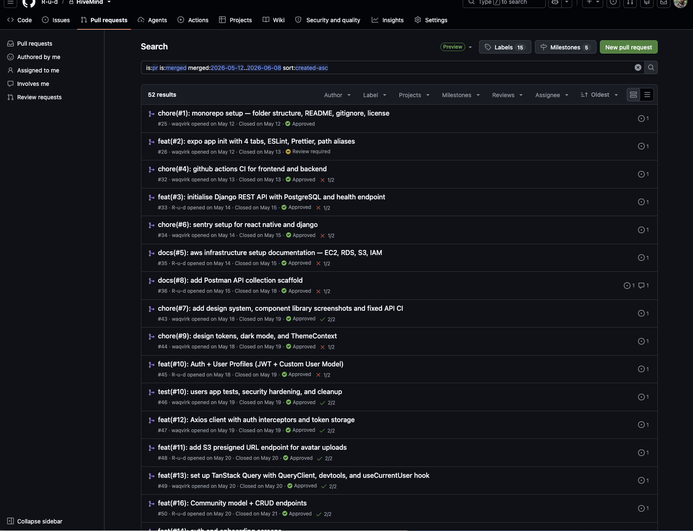
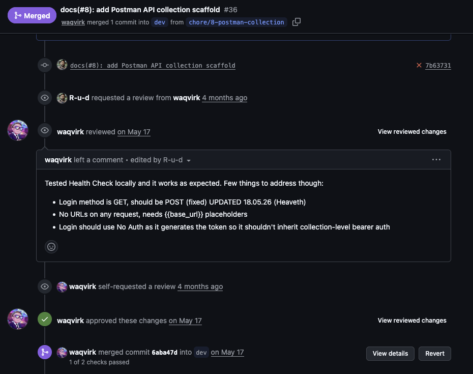

# How this was built

A four-week final project at WBS Coding School, 12 May – 8 June 2026, by two developers.

## The numbers

| | |
|:--|--:|
| Duration | 4 weeks |
| Developers | 2 |
| Pull requests merged | 52 |
| Commits (excluding merges) | 182 |

**Reviews went both ways.** Every one of my teammate's 26 pull requests was reviewed by me;
25 of my 29 were reviewed by him. Nothing reached `dev` without a second pair of eyes.

## How we worked

- **Issue-driven.** Every branch traced back to a numbered issue: `feat/32-home-feed-endpoint`,
  `fix/40-feed-performance`, `chore/43-community-type-colour-audit`.
- **Branch  naming** followed `<type>/<issue-number>-<slug>`, with `feat`, `fix`, `chore`,
  `docs` and `test` as the types.
- **`dev` was the integration branch.** Feature branches merged into `dev` through reviewed
  pull requests; `main` only received releases.
- **CI ran on every PR.** Typecheck, eslint and jest for the app; ruff and pytest against a
  real Postgres instance for the API. Pre-commit hooks ran the same checks locally before
  anything left the machine. The backend job was still being stabilised in the first week —
  seven pull requests up to 18 May merged with it red. From PR #46 onwards every merge was
  green on both jobs.
- **A bug bash before the deadline** (`fix/39-bug-bash`) — a focused pass where both of us
  went hunting rather than building.

## Who did what

| | Waqar ([@waqvirk](https://github.com/waqvirk)) | Rud ([@R-u-d](https://github.com/R-u-d)) |
|:--|:--|:--|
| Lead | Frontend | Backend |
| Main areas | Screens, components, navigation, app test suite, assets, CI workflows, pre-commit setup | API apps and models, auth and user profiles, Django settings and core, Postman collection, AWS infrastructure docs |
| Crossover | Contributed substantially to the API as well | Built several screens and the client data layer |

Neither of us stayed on one side of the stack. The split above describes where each of us
carried the weight, not where we were allowed to work.

## What this looked like

All 52 merged pull requests of the four-week MVP, oldest first:

A review with substance — three concrete findings, then an approve:

Most of the other 51 reviews were shorter than this one; several were a plain approve with
no comment. The claim here is that every pull request had a second reader before it merged,
not that every one produced a discussion.

The pull requests themselves live in the original private repository, which continued as a
desktop application. Their index is exported to [pull-requests.md](pull-requests.md), and
the issues they closed to [issues.md](issues.md). The project board that scheduled the
work — five milestones, start and end dates — is exported to
[project-board.md](project-board.md). The numbers and branch names in them match the
merge commits in `git log`.